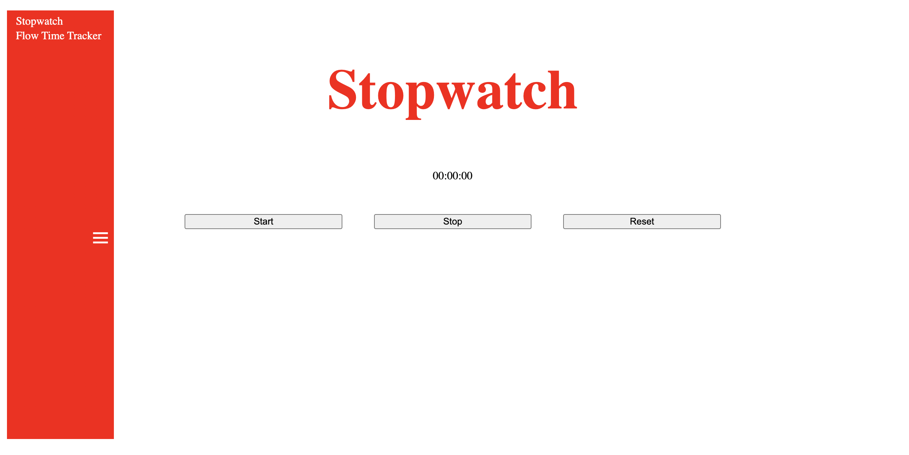

# Joshua Lee (jlee6890) - StudBud Documentation
My web app 'StudBud' is targeted towards users with mental health conditions, allowing them to feel supported and safe while using my prototype. By focusing on this target audience, my web app has multiple features such as a dark-light mode, nature-related style, and a daily reminder on the opening page, all of which have been designed from both primary and secondary research conducted in Assessment 2. 

For the majority of StudBud's development, I used Google Chrome however some features seemed to show up in Safari rather than Chrome (which have been specified in the relevant sections).

## Key Features and Sections
### _Kanban Board_
The kanban board is one of the main sections of my StudBud web app, where users can input tasks and have them displayed in columns which can be edited and customised. The main features of my kanban board resemble the prototype I created in Assessment 3, however the biggest change was in relation to the styling and aesthetics. Rather than having a cave and lake illustration as the background, I decided to create my own illustrations for each theme that would appear into the kanban board columns, as feedback from tutors and user testing revealed how the initial background idea was seen as distracting. 

 
(screenshots of the kanban board's development above)

(screenshots of the kanban board's illustrations above)

### _Stopwatch and Flow Time Tracker_
The stopwatch and flow time tracker are placed inside the navigation sidebar, allowing users to switch between the other sections and the timers with ease. While this feature of StudBud does resemble my prototype, I found its functionality was dependent on the browser used. In Google Chrome, the timers did not function properly but in Safari, they worked as desired.

(screenshots of the stopwatch and flow time tracker's development above)

### _Acronym Maker_

## Limitations and Future Development 
While my web app does reflect many of the key components of my initial prototype, there are also several issues that I was not able to resolve due to time and ability restraints. 

The first is the music player; while I was able to create the relevant code for the music player, I was unable to make the audio play. Although I did bring this issue up to tutors, they were unsure about the errors I was receiving and how to fix them, making it difficult to debug my music player. An alternative was to use an external music source, however I was not able to implement it in time and I was also unsure as to how to implement it. 

Another issue was getting the dark and light mode styles to extend past the 'Account Settings' page and apply to other sections such as the 'Kanban Board' and 'Acronym Maker' pages. I did successfully create functions and utilise local storage to keep the user's style preference on the 'Account Settings' page, but I wasn't able to store and apply the styles to other pages. This feature is something I would like to improve upon for future development as I believe it does create weaknesses in my web app. 

## Lessons and Conclusion
Ultimately, my conceptualisation of StudBud delivers the main features I intended to create from past assignments, and provided me the opportunity to strengthen my coding abilities. The process was definitely filled with moments of frustration, but I also learnt that I am capable of creating a functional web app and challenging myself in relation to coding and programming, a field of design that had previously been a big weakness of mine. 

While this web app is only a university assignment, I would also greatly appreciate any advice and feedback, particularly in regards to the limitations mentioned above. StudBud is definitely a project I would love to expand upon, especially without the presence of deadlines. 

## References 
https://mentalhealthmatch.com/articles/anxiety/inspiring-mental-health-quotes
Drew video from Slack
https://www.w3schools.com/howto/howto_css_modals.asp
https://www.youtube.com/watch?v=QTHRWGn_sJw&t=1376s
https://www.youtube.com/watch?v=m3StLl-H4CY&list=LL&index=21&t=923s 
https://itsallyouboo.com/daily-activities-to-improve-mental-health/
https://www.talkspace.com/blog/12-best-ways-spend-mental-health-day-according-therapist/ 

**bold**

> quote text